# Riko Chat — The Universal Access Layer

A deep map of chat as Riko's primary interface — every feature reachable, every input modality, every output shape, every conversation pattern.

---

## The thesis

Chat in Riko isn't *a feature alongside the dashboard*. It's a **parallel product surface** that mirrors and extends the entire product. Every screen has a chat-side equivalent. Some things are *only* accessible through chat (asking arbitrary questions, dropping files, voice, cross-feature composition).

The founder shouldn't need to know which tab to open. They just say what they need.

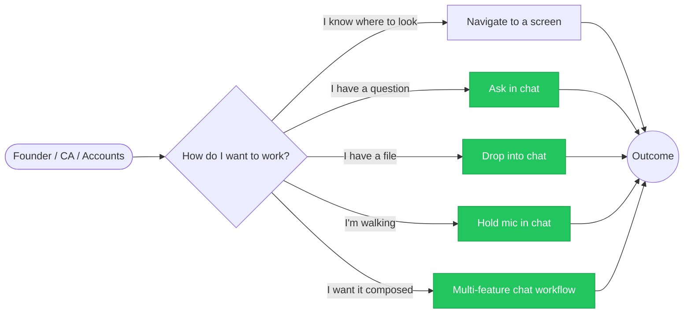

The four green paths all flow through one chat interface. The grey "surface" path remains for power users and intensive review, but it's the **secondary** path.

---

## Table of contents

1. [The chat universe — master mindmap](#1-the-chat-universe--master-mindmap)
2. [Input modalities — six ways to talk to Riko](#2-input-modalities--six-ways-to-talk-to-riko)
3. [Query intent — taxonomy of what users ask](#3-query-intent--taxonomy-of-what-users-ask)
4. [Output catalog — how Riko responds](#4-output-catalog--how-riko-responds)
5. [Feature access map — every Riko capability via chat](#5-feature-access-map--every-riko-capability-via-chat)
6. [Agentic workflow patterns](#6-agentic-workflow-patterns)
7. [Conversation lifecycle](#7-conversation-lifecycle)
8. [Trust & control layer](#8-trust--control-layer)
9. [Memory & personalization](#9-memory--personalization)
10. [Cross-feature composition — the chat-only superpower](#10-cross-feature-composition--the-chat-only-superpower)
11. [Surface vs chat — when each wins](#11-surface-vs-chat--when-each-wins)

---

## 1. The chat universe — master mindmap

Every dimension of chat as a product surface.

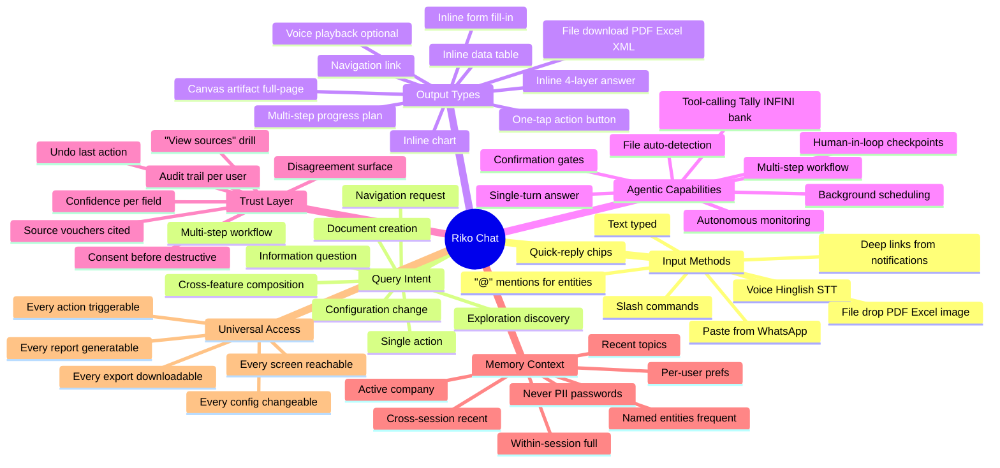

---

## 2. Input modalities — six ways to talk to Riko

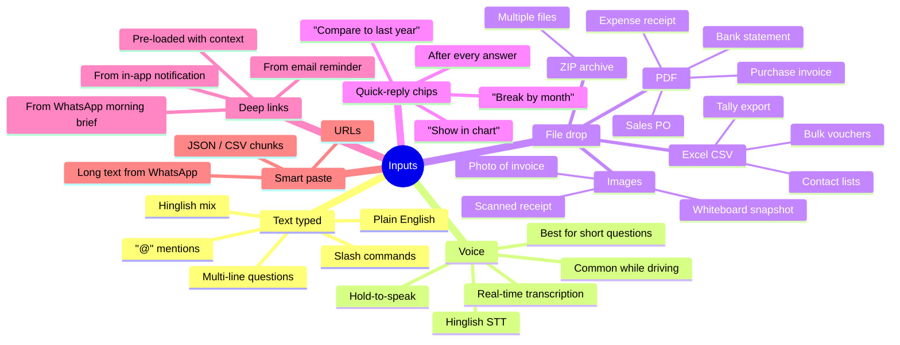

### When each modality wins

| Situation | Best input |
|---|---|
| At desk, deep query | Typed text |
| Walking / driving | Voice |
| Reviewing emailed invoice | File drop |
| Following up an answer | Quick-reply chip |
| Coming from a notification | Deep link with pre-context |
| Sharing data from another tool | Smart paste |

---

## 3. Query intent — taxonomy of what users ask

What kinds of things does a user say? Eight intent classes:

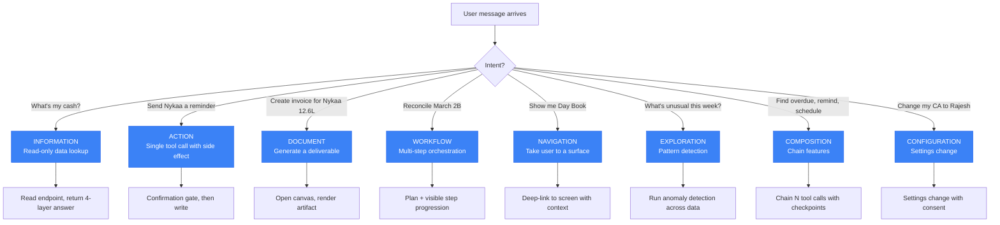

The intent classifier is the **first decision** Riko makes on every message. The downstream tool routing, output shape, and confirmation requirements all branch from this classification.

---

## 4. Output catalog — how Riko responds

Nine output shapes, each with distinct UX.

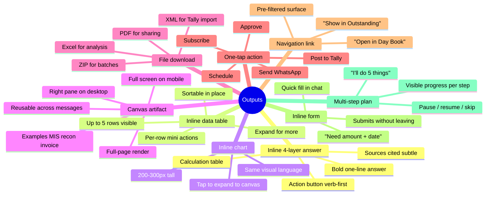

### Output decision logic

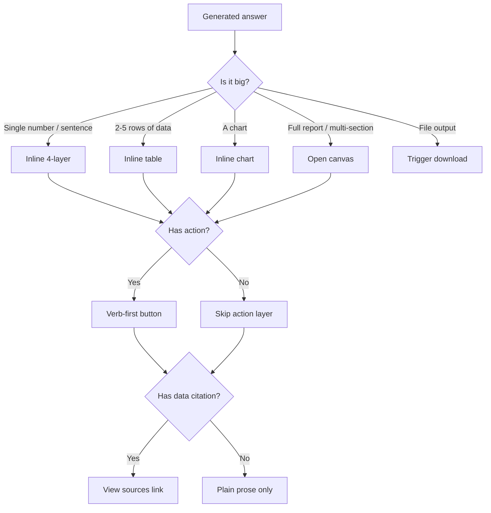

---

## 5. Feature access map — every Riko capability via chat

Every screen + section, with example natural-language phrasings that reach it.

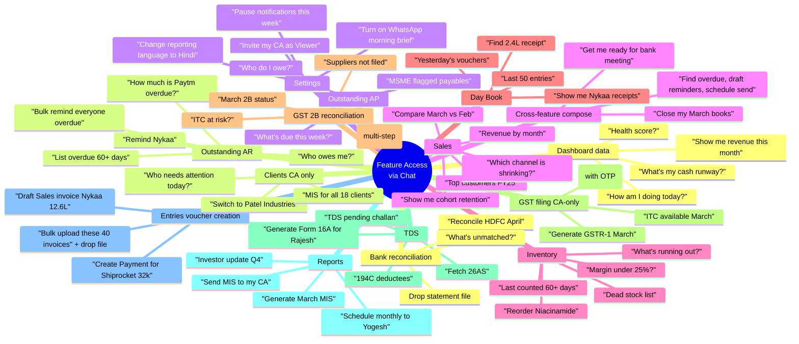

### Access decision matrix

| If user says... | Riko reaches into... | Output |
|---|---|---|
| "cash runway" | Dashboard runway calculation | 4-layer answer + traceId |
| "who owes me" | Outstanding receivables aggregate | Action-list of parties with Remind buttons |
| "remind Nykaa" | Outstanding + WhatsApp templates | Confirmation gate → WhatsApp send |
| "create invoice for X" | Entries voucher creation | Inline form for missing fields → draft + canvas preview |
| "drop a bank statement" | Bank reconciliation | Auto-recon, canvas with matched/unmatched |
| "March MIS to CA" | Reports + WhatsApp send + saved CA contact | Canvas preview → confirm → send toast |
| "reconcile 2B" | GST Agent + INFINI 2B fetch | Multi-step workflow with visible steps |
| "switch to Patel" | Clients context switcher | Whole app re-renders for that company |

---

## 6. Agentic workflow patterns

Six shapes of agentic work, from simplest to most complex.

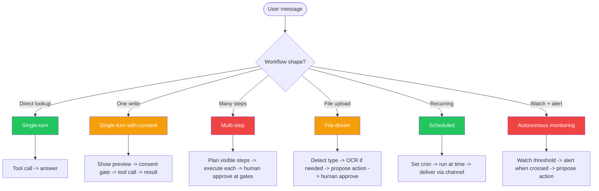

### Pattern examples

| Pattern | Example user query | Riko's behavior |
|---|---|---|
| **Single-turn** | "What's my cash?" | One tool call, one answer |
| **Single-turn with consent** | "Send Nykaa a reminder" | Show preview of message → user confirms → WhatsApp send |
| **Multi-step** | "Reconcile March 2B" | 5 visible steps unfold (fetch 2B → match → flag at-risk → draft corrections → open canvas) |
| **File-driven** | drop `hdfc-april.pdf` | Detect bank statement → OCR/parse 147 lines → match 129 → present 18 unmatched for review |
| **Scheduled** | "Send me MIS every 5th of month" | Save schedule → cron fires → MIS generated → WhatsApp delivered |
| **Autonomous** | "Tell me if Nykaa pays" | Watch ledger → trigger when receipt voucher arrives → push notification + WhatsApp |

---

## 7. Conversation lifecycle

How a chat thread evolves over time.

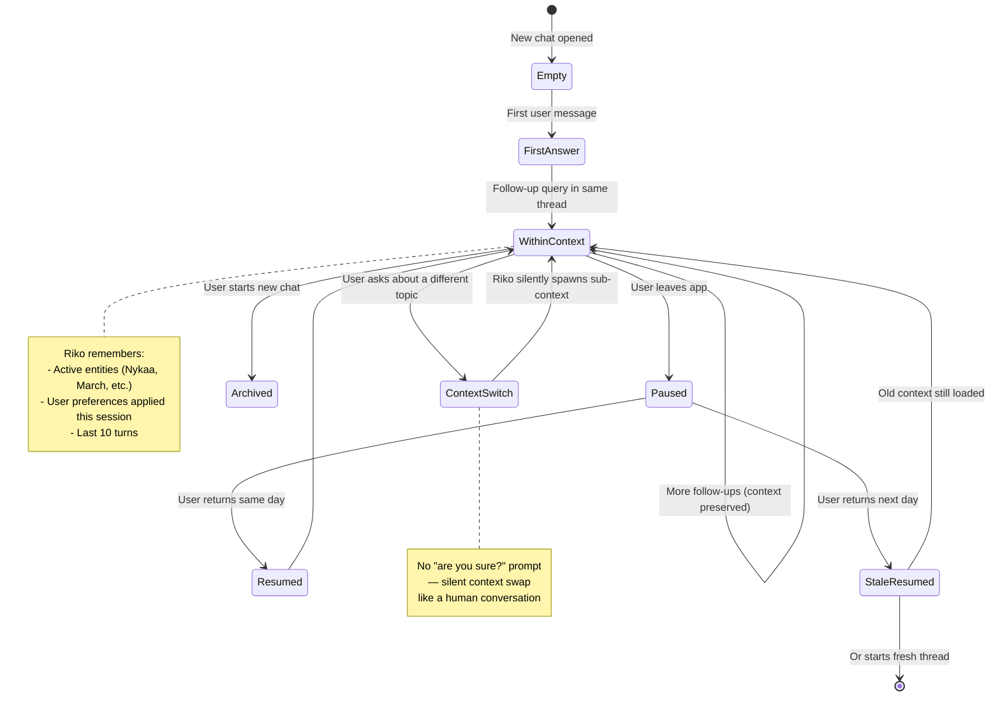

**Design principle**: never interrupt the user with "start a new chat?" prompts. The conversation is whatever they're talking about right now. Context switches happen silently.

---

## 8. Trust & control layer

How Riko earns trust without being defensive.

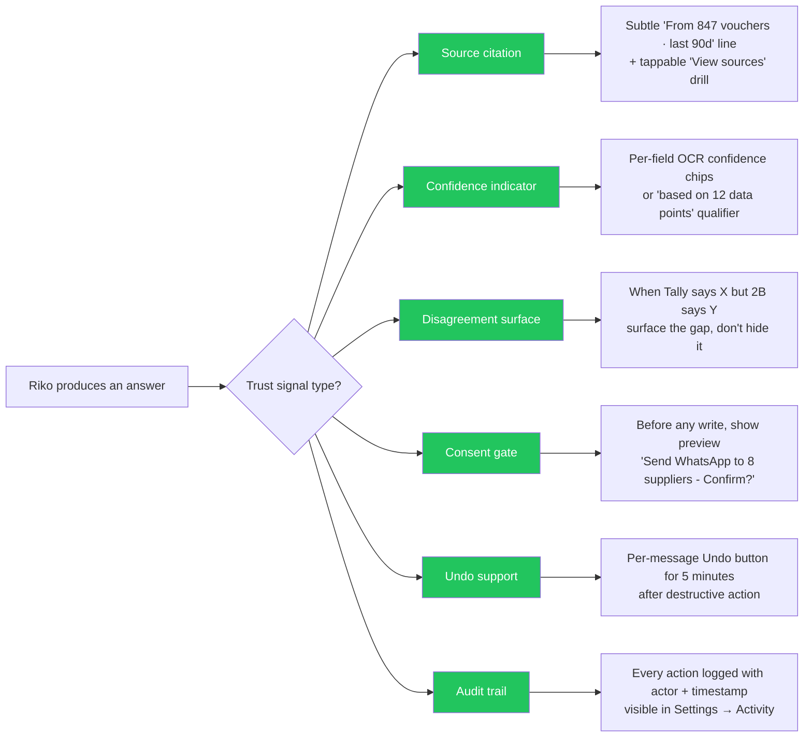

### Anti-patterns to avoid

```mermaid
flowchart TD
    A[Bad chat behavior] --> A1[Hidden errors]
    A --> A2[Confident hallucination]
    A --> A3[Auto-actions without consent]
    A --> A4[Buried sources]
    A --> A5[No undo on destructive]
    A --> A6[Notification spam]
    A --> A7[Decorative AI claims]

    A1 --> Fix1[Always surface failures with reason]
    A2 --> Fix2[Cite vouchers — if can't, say "I don't have this"]
    A3 --> Fix3[Consent gate before writes]
    A4 --> Fix4[Source line always rendered subtle]
    A5 --> Fix5[5-minute undo window after writes]
    A6 --> Fix6[One push/day cap]
    A7 --> Fix7["Riko found something" only when actually surprising]

    classDef bad fill:#EF4444,color:#fff
    classDef fix fill:#22C55E,color:#fff
    class A1,A2,A3,A4,A5,A6,A7 bad
    class Fix1,Fix2,Fix3,Fix4,Fix5,Fix6,Fix7 fix
```

---

## 9. Memory & personalization

What Riko remembers, scoped by lifetime.

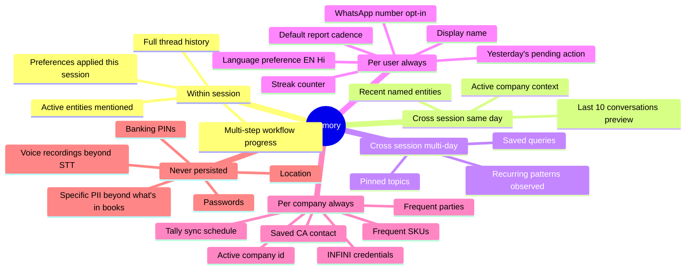

### Memory hierarchy

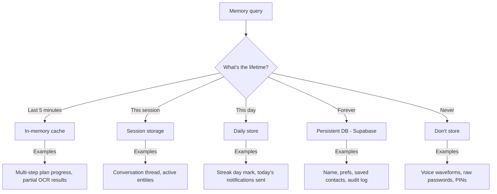

---

## 10. Cross-feature composition — the chat-only superpower

The thing chat enables that no surface can: chaining features in one breath. Six worked examples.

### 10.1 "Get me ready for the bank meeting tomorrow"

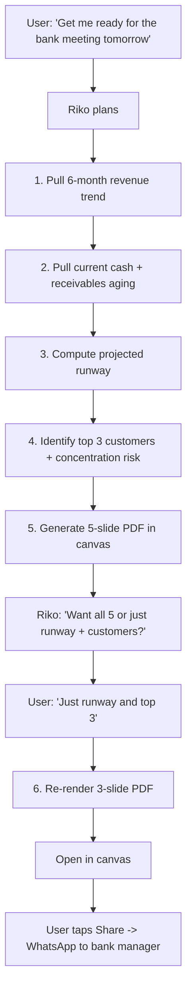

### 10.2 "Why was September CAC so high?"

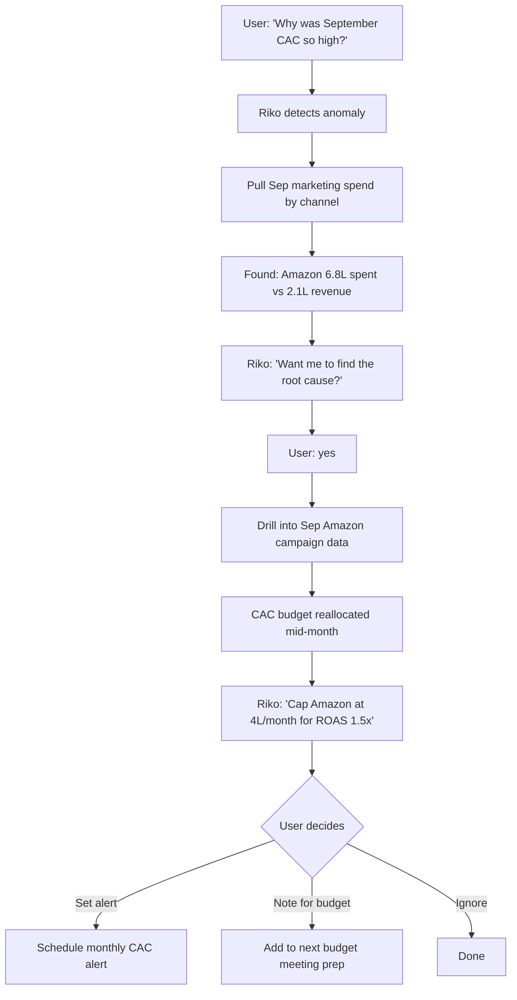

### 10.3 "Close my March books"

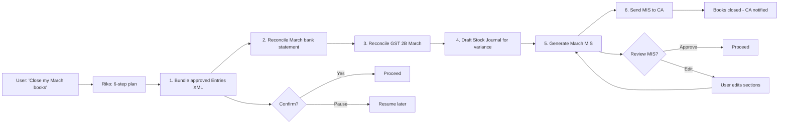

### 10.4 "Clean up dead stock"

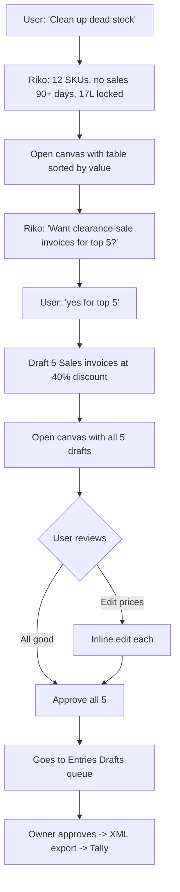

### 10.5 "Set up daily morning brief on WhatsApp"

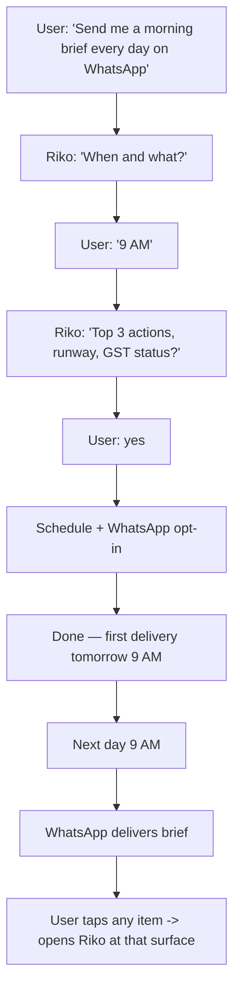

### 10.6 "Find me a pattern I'm missing"

The discovery pattern — Riko surfaces what the user didn't ask for.

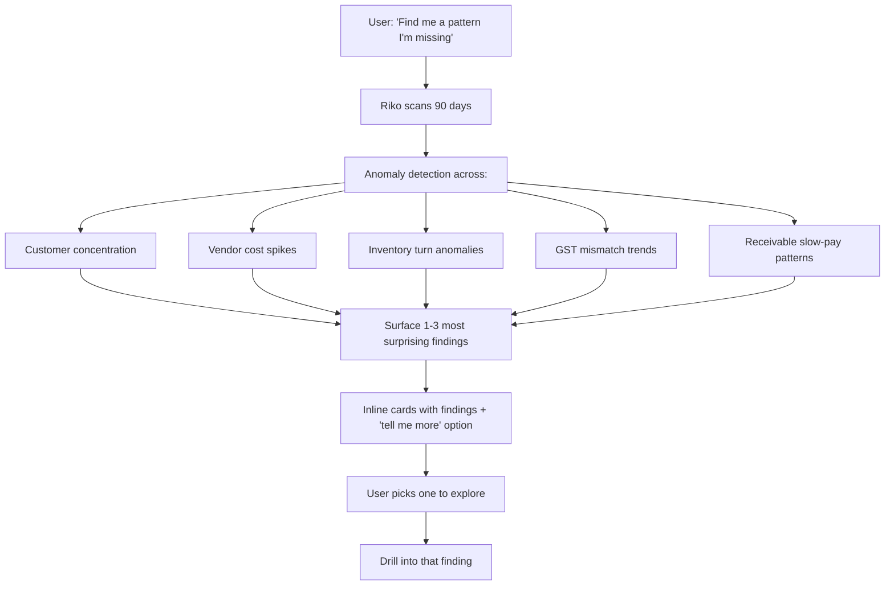

---

## 11. Surface vs chat — when each wins

A decision matrix for the user.

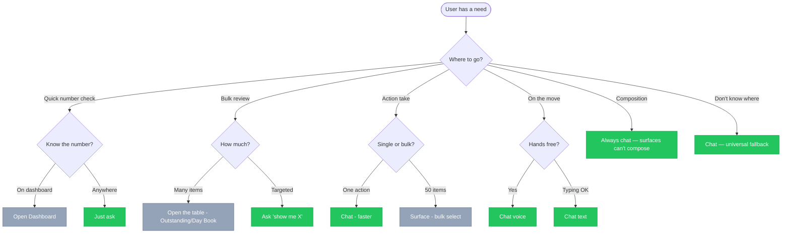

### Quick reference

| Situation | Use surface | Use chat |
|---|---|---|
| Single quick lookup | If you remember which screen | Always works |
| Bulk review of many rows | ✓ — tables shine | Awkward |
| Single action on one item | OK | Faster |
| Bulk action across many | ✓ — multi-select bar | Possible but typing-heavy |
| On mobile, on the move | Cramped | ✓ voice + chat |
| Cross-feature composition | Impossible | ✓ only path |
| First-time exploration | Hard to know where | ✓ ask anything |
| Recurring scheduled task | Manual every time | ✓ "every Monday do X" |
| Deep analytical drill | ✓ — multi-pane | Possible if you know how to ask |
| Compliance / regulated action | ✓ — audit-friendly visible flow | Use chat to draft, surface to approve |

---

## Final principle

**Chat is the front door. Surfaces are the rooms.**

A new user's first dozen interactions should all be chat-driven. Once they know what they want and where it lives, they may navigate to surfaces directly for power-user efficiency. But chat remains the universal access layer — every action, every report, every export, every config change reachable through natural language.

Pair this map with:
- [`USER-FLOWS.md`](./USER-FLOWS.md) — overall user journeys including chat
- [`sections/chat.md`](./sections/chat.md) — the per-screen UX spec
- [`IMPLEMENTATION-PLAN.md`](./IMPLEMENTATION-PLAN.md) — engineering roadmap with chat as the highest-leverage Tier 2 work
