# Riko — User Perspective Flow Analysis

A mindmap + workflow + decision-tree analysis of the riko-ux-prototype from the **user's perspective**. Each diagram is rendered with Mermaid (works natively on GitHub, VS Code Markdown preview, Obsidian, Notion).

---

## Table of contents

1. [The product as one mindmap](#1-the-product-as-one-mindmap)
2. [Three personas — three mental models](#2-three-personas--three-mental-models)
3. [First-time user — entering the product](#3-first-time-user--entering-the-product)
4. [Daily ritual — a founder's morning](#4-daily-ritual--a-founders-morning)
5. [Jobs-to-be-done — task flows](#5-jobs-to-be-done--task-flows)
6. [Workflow state machines](#6-workflow-state-machines)
7. [Decision tree — "I need to…"](#7-decision-tree--i-need-to)
8. [Cross-section flows — how features connect](#8-cross-section-flows--how-features-connect)
9. [A typical day — journey map](#9-a-typical-day--journey-map)

---

## 1. The product as one mindmap

The complete product surface as a user perceives it — five concept areas branching from Riko at the center.

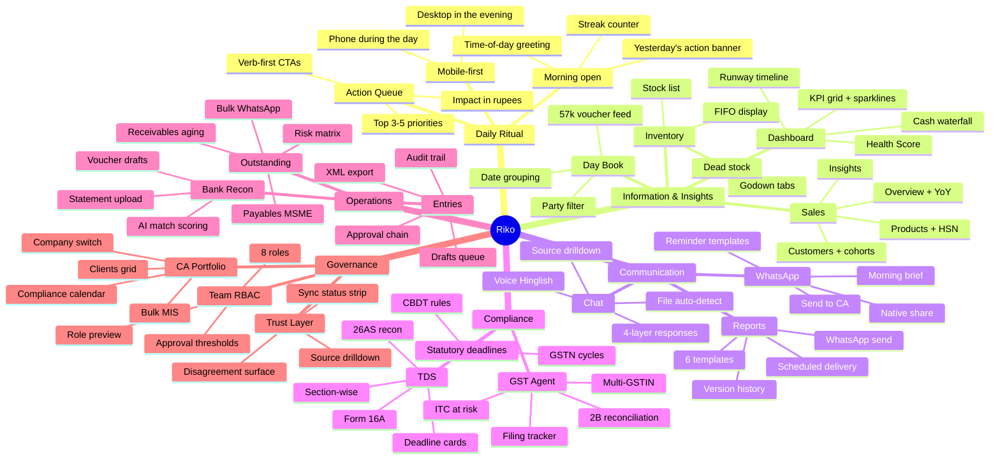

---

## 2. Three personas — three mental models

The same product surfaces, viewed through three different lenses.

### 2.1 SMB Founder (primary persona)

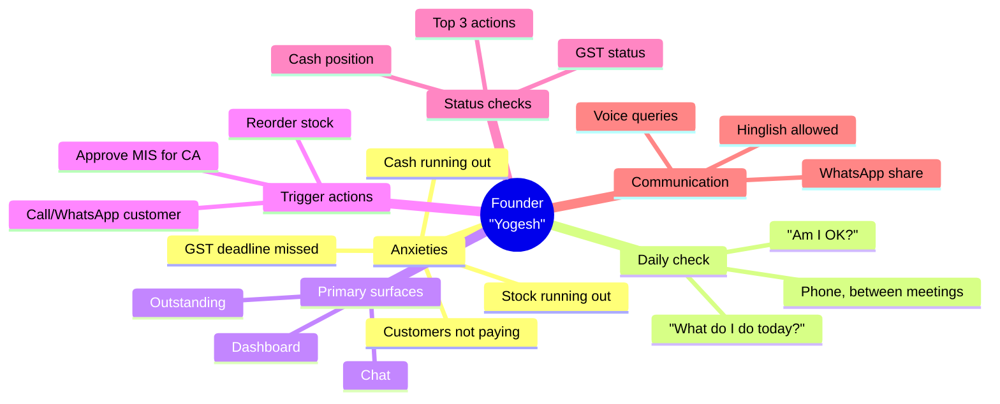

### 2.2 Chartered Accountant (secondary persona)

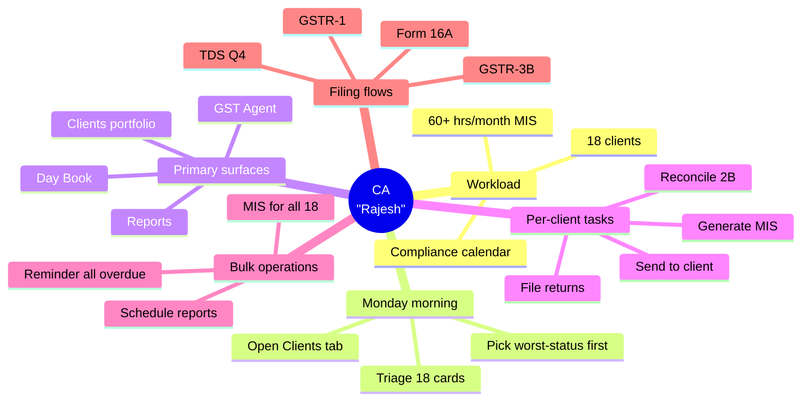

### 2.3 Accounts staff (tertiary persona)

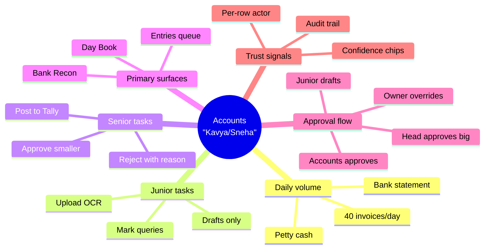

---

## 3. First-time user — entering the product

The journey from the very first visit to the first valuable answer.

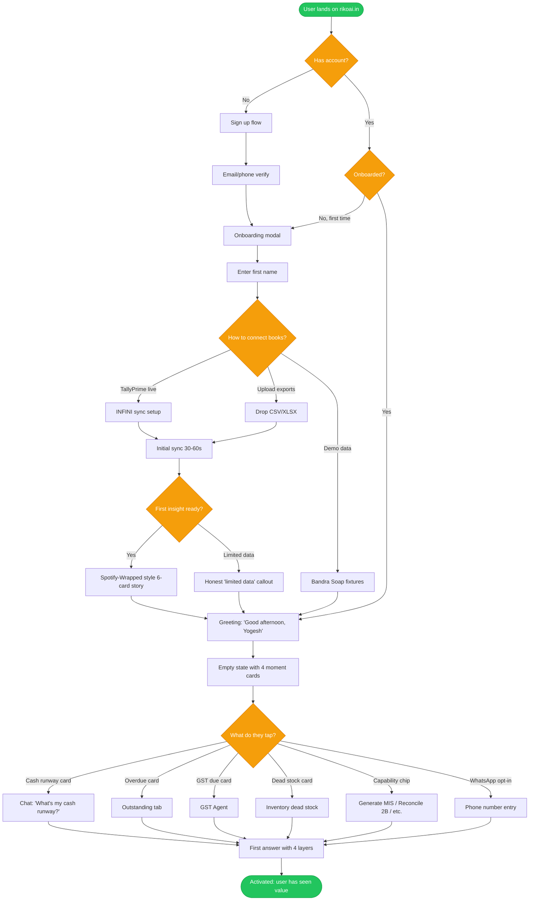

**Key UX principles in this flow:**
- Onboarding has only **3 paths** (Tally / Upload / Demo) — no decision overload
- The "First Insight" is the activation wedge — Wrapped-style summary the moment data lands
- The empty state isn't generic prompt chips — it's **the user's actual current moment** ("₹17.4L overdue", "GSTR-3B due in 5 days") drawn from their data
- WhatsApp opt-in sits in the empty state, not buried in Settings

---

## 4. Daily ritual — a founder's morning

The most common interaction — opening Riko on a phone with breakfast.

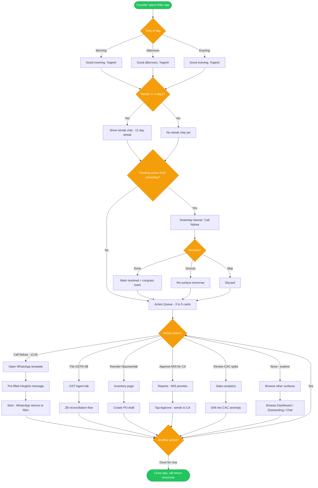

**Key UX principles:**
- The app is **task-oriented**, not data-oriented. Every visit ends in an action taken or a decision made.
- The **streak + yesterday's action** create a daily-return loop *without* manipulative dark patterns.
- Each Action Queue item carries an **impact in rupees** so the founder knows which to pick first.
- Almost every action terminates in **WhatsApp** (the substrate where Indian SMBs actually live).

---

## 5. Jobs-to-be-done — task flows

The five most common reasons a founder opens Riko, each as its own flow.

### 5.1 "Am I running out of money?"

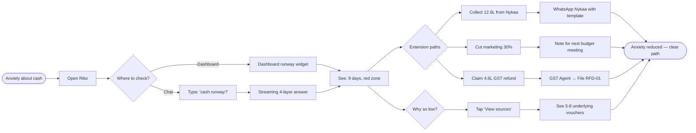

### 5.2 "Who owes me money?"

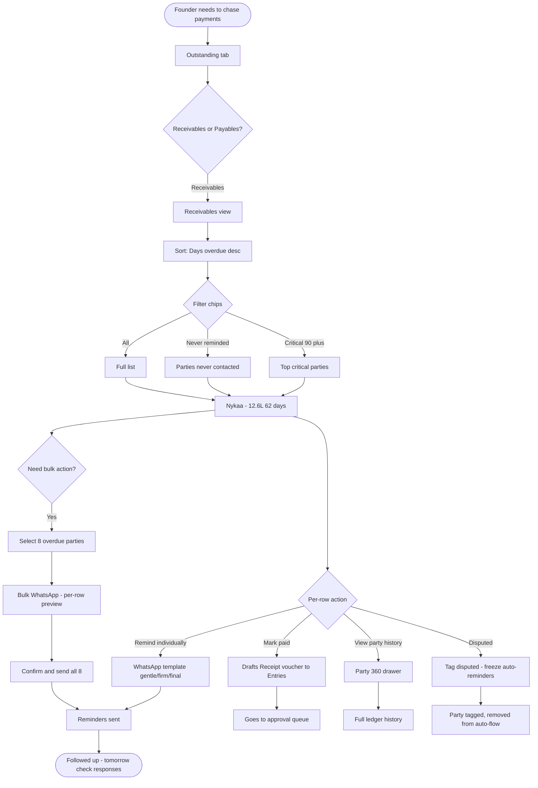

### 5.3 "I need to send my CA the March MIS"

This is the **highest-frequency SMB↔CA interaction**, and the headline collaboration flow.

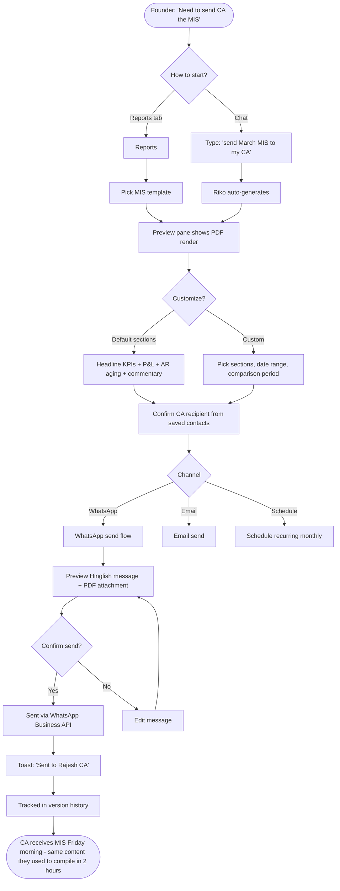

### 5.4 "A vendor invoice arrived — get it into the books"

The canonical **agentic file-upload moment**. This is what makes Riko feel like a copilot.

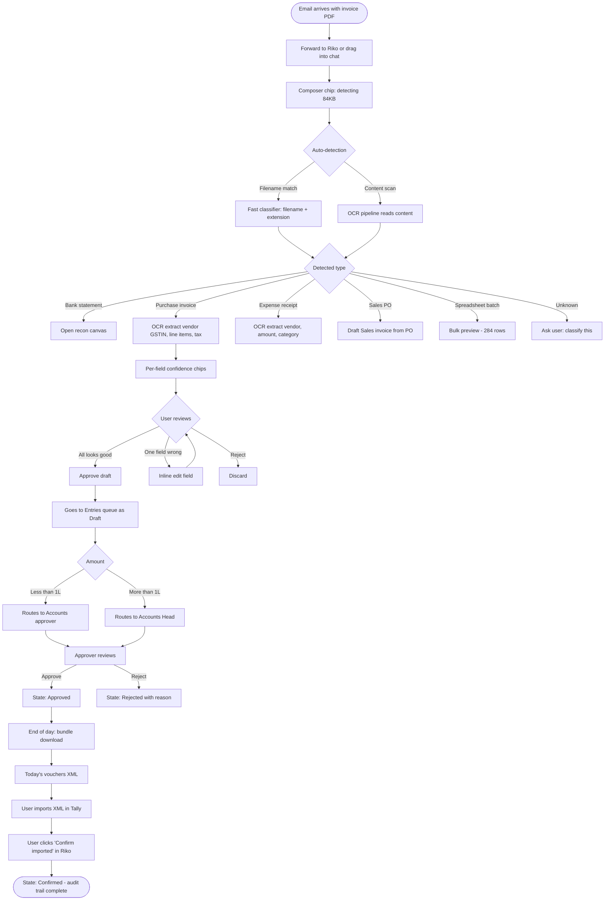

### 5.5 "Reconcile my March 2B" (multi-step agentic workflow)

The most ambitious chat-driven workflow — it unrolls in visible steps.

```mermaid
flowchart LR
    Ask([Type: reconcile March 2B]) --> Plan[Riko plans 5 steps]

    Plan --> S1[Step 1: Fetch GSTR-2B from INFINI]
    S1 --> S1Done[150 lines fetched]
    S1Done --> S2[Step 2: Match against Tally purchase vouchers]
    S2 --> S2Done[129 matched, 12 mismatches, 8 missing 2B, 2 missing Tally]
    S2Done --> S3[Step 3: Flag 4.2L ITC at risk]
    S3 --> S3Done[8 suppliers haven't filed GSTR-1]
    S3Done --> S4[Step 4: Draft Stock Journal corrections for variances]
    S4 --> S4Done[3 corrections drafted]
    S4Done --> S5[Step 5: Open recon canvas for human review]
    S5 --> Canvas[Canvas opens with full recon table]

    Canvas --> Decide{Per-line decisions}
    Decide -->|Accept matched 129| AcceptAll[Bulk accept all 99% confidence matches]
    Decide -->|Investigate mismatch| Inv[Side-by-side diff drawer]
    Decide -->|Remind missing 2B| Remind[Bulk WhatsApp 8 suppliers]
    Decide -->|Record missing Tally| Record[Open voucher draft form]

    AcceptAll --> Status[Update status to matched]
    Inv --> Resolved[Mark resolved with reason]
    Remind --> Reminders[8 reminders queued]
    Record --> NewDraft[New draft to Entries]

    Status --> Final[All 150 lines reconciled]
    Resolved --> Final
    Reminders --> Final
    NewDraft --> Final

    Final --> Done([Recon complete - ITC claim ready for filing])
```

---

## 6. Workflow state machines

### 6.1 Entries lifecycle (with XML write-back)

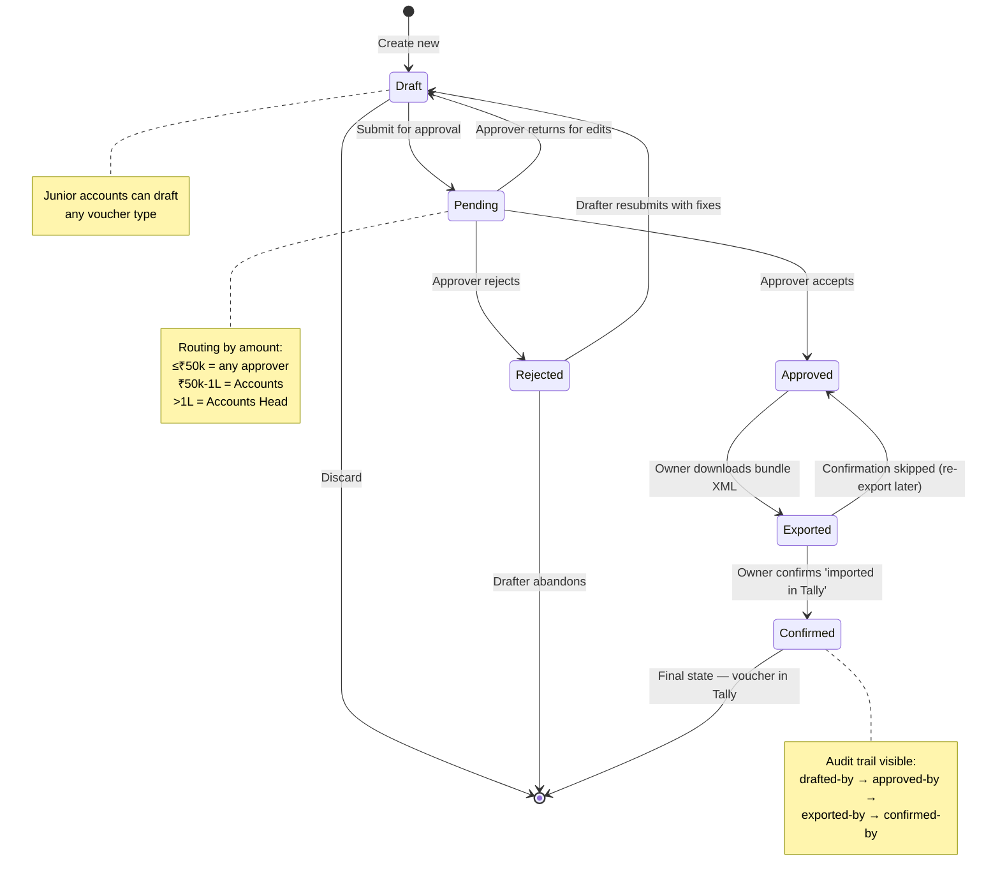

### 6.2 GST 2B reconciliation match states

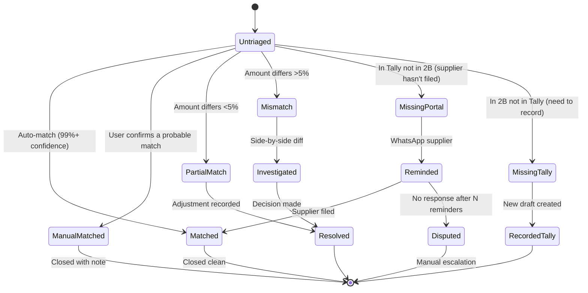

### 6.3 Outstanding reminder escalation

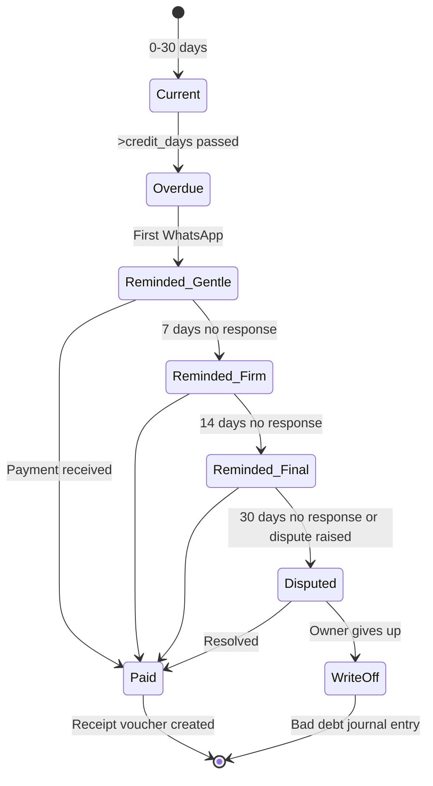

---

## 7. Decision tree — "I need to…"

What every common user task maps to in Riko.

```mermaid
flowchart TD
    Need([User has a need]) --> Type{What kind?}

    Type -->|Money question| Money{Money sub-type}
    Type -->|Document task| Doc{Document sub-type}
    Type -->|Compliance| Comp{Compliance sub-type}
    Type -->|Operations| Ops{Operations sub-type}
    Type -->|Setup change| Setup{Setup sub-type}

    Money -->|Cash position| Dash1[Dashboard runway]
    Money -->|Top customers| Sales1[Sales > Customers]
    Money -->|Profit/loss| Reports1[Reports > P&L Deep Dive]
    Money -->|Bank balance| BankRecon1[Bank Recon]
    Money -->|Anything else| Chat1[Chat - just ask]

    Doc -->|Generate MIS| Reports2[Reports > MIS]
    Doc -->|Need an invoice| Entries1[Entries > New Sales]
    Doc -->|Got a bill| Entries2[Drag PDF into chat - auto-detect]
    Doc -->|Send to CA| Reports3[Reports > WhatsApp send]
    Doc -->|Bulk import| Entries3[Entries > Bulk upload modal]

    Comp -->|GST status| GST1[GST Agent dashboard]
    Comp -->|2B reconcile| GST2[GST > Reconciliation tab]
    Comp -->|File GSTR-1| GST3[GST > GSTR-1 - CA only]
    Comp -->|TDS workings| TDS1[TDS section-wise]
    Comp -->|Form 16A| TDS2[TDS > Generate Form 16A]
    Comp -->|26AS recon| TDS3[TDS > 26AS reconciliation]

    Ops -->|Who owes me| Out1[Outstanding > Receivables]
    Ops -->|Who I owe| Out2[Outstanding > Payables]
    Ops -->|Stock check| Inv1[Inventory list]
    Ops -->|Dead stock| Inv2[Inventory > Dead Stock]
    Ops -->|Physical count| Inv3[Inventory > Reconcile Physical]
    Ops -->|Voucher search| Day1[Day Book - search]

    Setup -->|Add team| Settings1[Settings > Team > Invite]
    Setup -->|Change role| Settings2[Settings > Team]
    Setup -->|Connect Tally| Settings3[Settings > Integrations]
    Setup -->|API access| Settings4[Settings > API Keys]
    Setup -->|Notifications| Settings5[Settings > Notify]
    Setup -->|WhatsApp number| Settings6[Settings > WhatsApp]

    Chat1 --> Universal[Chat is the universal fallback]
```

**The product principle behind this tree:**
Every task maps to **either a dedicated screen** (when the user knows where to go) **or chat** (when they don't, or it's faster to ask). Chat is the universal fallback — never a dead end.

---

## 8. Cross-section flows — how features connect

The product's value compounds when features chain together. Three canonical chains:

### 8.1 Outstanding → Mark Paid → Entries → Tally

```mermaid
flowchart LR
    Out[Outstanding row: Nykaa 12.6L overdue] --> Mark[Tap 'Mark Paid']
    Mark --> Sheet[Receipt voucher draft sheet]
    Sheet --> Fill[Fill amount, date, mode, UTR, bank]
    Fill --> Save[Save creates Receipt voucher in Entries queue]
    Save --> Entries[Entries > Drafts tab]
    Entries --> Approve[Approver approves]
    Approve --> Bundle[Owner downloads today's XML bundle]
    Bundle --> Tally[Imports into Tally]
    Tally --> Confirm[Confirms in Riko]
    Confirm --> OutUpdate[Outstanding now shows 0 due for Nykaa]
```

### 8.2 Bank Statement upload → AI match → Entries → Tally

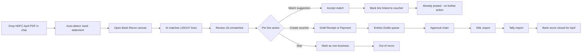

### 8.3 Inventory Physical Count → Variance → Stock Journal → Tally

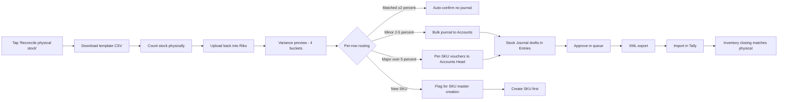

---

## 9. A typical day — journey map

A founder's full day with Riko, plotted on a satisfaction curve.

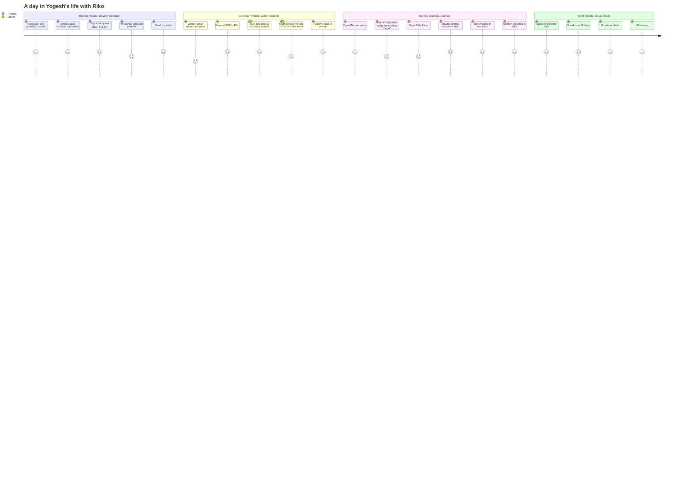

---

## Reading the diagrams

**On GitHub:** all Mermaid diagrams render automatically in the file viewer.

**In VS Code:** install the *"Markdown Preview Mermaid Support"* extension, then `Ctrl+Shift+V` opens the preview.

**In Obsidian / Notion / Bear:** native Mermaid support.

**As images:** if you need static PNG/SVG exports for a deck, paste any individual diagram into [mermaid.live](https://mermaid.live) — it renders + exports.

---

## What this document is for

Three audiences, three uses:

1. **Engineering** — the state machines and cross-section flows are the canonical specs for the workflow features (Entries, Bank Recon, GST recon).
2. **Product / Design** — the persona mindmaps and JTBD flows are the basis for usability testing scripts and onboarding flow design.
3. **Leadership / Investors** — the high-level mindmap and journey map are the simplest way to communicate the product surface in a single image.

Pair this with [`IMPLEMENTATION-PLAN.md`](./IMPLEMENTATION-PLAN.md) (the engineering roadmap) and the section-level specs in [`docs/sections/`](./sections/) (the per-feature UX detail).
